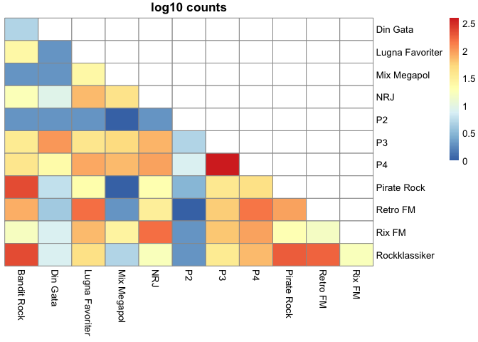
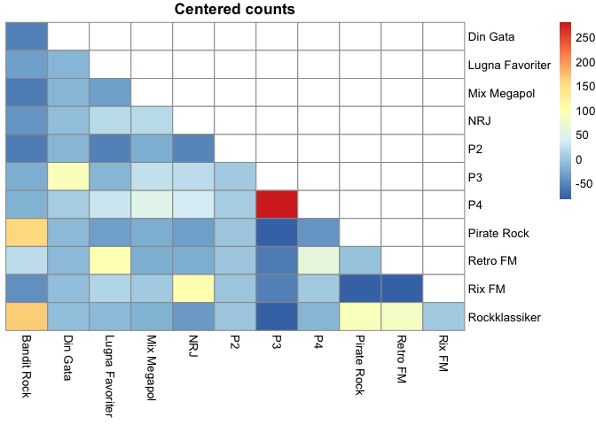

Similarity, uniqueness of Swedish radio stations
================
Martin Rydén

See **radio.R** for full script including data scraping. Presented data
is from past 7 days (July
1st).

## How many songs were played?

#### Total number of songs (including duplicates) played between 2021-06-25 and 2021-07-01

| Station        | Number of songs |
| :------------- | --------------: |
| Din Gata       |            2999 |
| mixmegapol     |            2615 |
| rix            |            2599 |
| lugnafavoriter |            2545 |
| banditrock     |            2205 |
| nrj            |            2054 |
| P3             |            2044 |
| rockklassiker  |            2038 |
| P4             |            1468 |
| P2             |            1130 |

## Uniqueness

#### Percentage of unique songs (within stations) – low % means high repetitiveness

| Station        | Unique songs | All songs | % unique |
| :------------- | -----------: | --------: | -------: |
| P2             |         1068 |      1130 |       95 |
| P4             |          999 |      1468 |       68 |
| P3             |         1108 |      2044 |       54 |
| rockklassiker  |          521 |      2038 |       26 |
| Din Gata       |          717 |      2999 |       24 |
| banditrock     |          509 |      2205 |       23 |
| nrj            |          385 |      2054 |       19 |
| lugnafavoriter |          346 |      2545 |       14 |
| mixmegapol     |          375 |      2615 |       14 |
| rix            |          293 |      2599 |       11 |

## Similarity

#### What radio stations played the same songs the most?

## Similarity heatmap

Similarity heatmap based on counts of same song played between sets of
radio stations. Log-transformed and centered plots to emphasize
dissimilarity.

