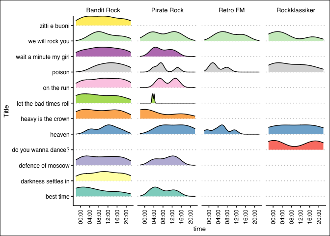

Similarity, uniqueness of Swedish radio stations
================
Martin Rydén

See **radio.R** for full script including data scraping. Presented data
is from past 7 days (July 2nd). Song identity is assumed based on name -
different songs with same name will be counted as the same. Scraped data
may be incorrect due to spelling variants, missing data, incomplete
sources etc. Only publicly available data is
used.

## How many songs were played?

#### Total number of songs (including duplicates) played between 2021-06-26 and 2021-07-02

| Station         | Number of songs |
| :-------------- | --------------: |
| Din Gata        |            5798 |
| P3              |            3900 |
| P4              |            2712 |
| Mix Megapol     |            2532 |
| Rix FM          |            2503 |
| Lugna Favoriter |            2489 |
| Retro FM        |            2354 |
| Bandit Rock     |            2149 |
| P2              |            2074 |
| NRJ             |            2055 |
| Rockklassiker   |            1969 |
| Pirate Rock     |            1947 |

## Uniqueness

#### Percentage of unique songs (within stations) – low % means high repetitiveness

| Station         | Unique songs | All songs | % unique |
| :-------------- | -----------: | --------: | -------: |
| P2              |          983 |      2074 |       47 |
| Pirate Rock     |          872 |      1947 |       45 |
| Retro FM        |          971 |      2354 |       41 |
| P4              |          927 |      2712 |       34 |
| Rockklassiker   |          526 |      1969 |       27 |
| P3              |         1057 |      3900 |       27 |
| Bandit Rock     |          508 |      2149 |       24 |
| NRJ             |          378 |      2055 |       18 |
| Mix Megapol     |          372 |      2532 |       15 |
| Lugna Favoriter |          346 |      2489 |       14 |
| Din Gata        |          698 |      5798 |       12 |
| Rix FM          |          279 |      2503 |       11 |

## Similarity

#### What radio stations played the same songs the most?

## Similarity heatmap

Similarity heatmap based on counts of same song played between sets of
radio stations. Log-transformed and centered plots to emphasize
dissimilarity.

## Timepoint analysis

#### Are certain songs played at a certain time?

For each group of stations, we investigate their shared top 12 songs and
plot them as ridge plots
(density/24h).

#### Pop, miscellaneous

#### Classical

<!-- -->

#### Rock

<!-- -->

Above plots show shared top 12 songs but has a bias toward stations that
play more songs and is more repetitive. We can reduce the plots to only
show songs that has been played at least a few times on each
station.

#### Pairwise comparisons, shared titles (inclusive)

